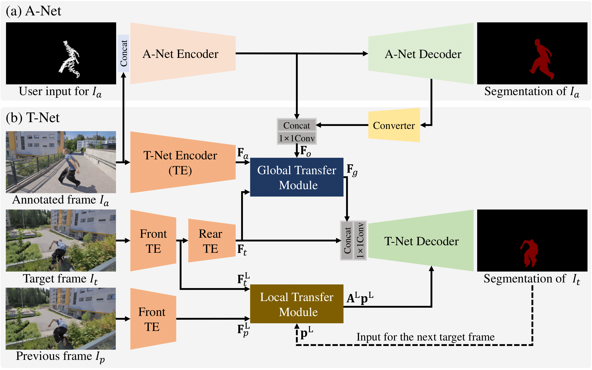

# Interactive Video Object Segmentation Using Global and Local Transfer Modules
### Yuk Heo, Yeong Jun Koh, Chang-Su Kim



[[Project page]](https://openreview.net/forum?id=bo_lWt_aA)
[[arXiv]](https://arxiv.org/abs/2007.08139)

Implementation of "Interactive Video Object Segmentation Using Global and Local Transfer Modules"

Codes in this github:

1. DAVIS2017 evaluation based on the [DAVIS framework](https://interactive.davischallenge.org/)
2. DAVIS2016 real-world evaluation GUI

## Prerequisite
- cuda 10.0
- python 3.6
- pytorch 1.2.0
- [davisinteractive 1.0.4](https://github.com/albertomontesg/davis-interactive)
- [corrlation package](https://github.com/NVIDIA/flownet2-pytorch/tree/master/networks/correlation_package) of [FlowNet2](https://github.com/NVIDIA/flownet2-pytorch)
- numpy, cv2, PtQt5, and other general libraries of python3

## Directory Structure
 * `root/libs`: library of utility files.

 * `root/networks` : network codes.
     - `correlation_package.zip` : conserves GPU memory by appling the correlation package of FlowNet2.
     - `deeplab`: applies ASPP module in decoders. [[original code]](https://github.com/jfzhang95/pytorch-deeplab-xception/tree/master/modeling)
     - `atnet.py`: consists A-Net and T-Net.
     - `ltm_transfer.py`: transfers previous segmentation with the local affinity of the local transfer module.

 * `root/config.py`  : configurations.
 
 * `root/eval_davis-framework.py` : DAVIS2017 evaluation based on the [DAVIS framework](https://interactive.davischallenge.org/).
  
 * `root/eval_real-world.py` : DAVIS2016 real-world evaluation GUI (to be released).

## Instruction

### DAVIS2017 evaluation based on the DAVIS framework

1. Edit `config.py` to set the directory of your DAVIS2017 dataset and the gpu ID.
2. Unzip and build [corrlation package](https://github.com/NVIDIA/flownet2-pytorch/tree/master/networks/correlation_package) by 
```
cd ./networks
unzip correlation_package.zip
cd correlation_package
rm -rf *_cuda.egg-info build dist __pycache__
python3 setup.py install --user
```
&nbsp;&nbsp;&nbsp;&nbsp;If you have problems in this step, you can find more information in the [repository](https://github.com/NVIDIA/flownet2-pytorch).

3. Download our [network parameters](https://github.com/NVIDIA/flownet2-pytorch/tree/master/networks/correlation_package) and place the file as `root/ATNet-checkpoint.pth`.
4. Run with `python3 eval_davis-framework.py`.

### DAVIS2016 real-world evaluation GUI

To be released

## Reference

Please cite our paper if the implementations are useful in your work:
```
@Inproceedings{
Yuk2020IVOS,
title={Interactive Video Object Segmentation Using Global and Local Transfer Modules},
author={Yuk Heo and Yeong Jun Koh and Chang-Su Kim},
booktitle={ECCV},
year={2020},
url={https://openreview.net/forum?id=bo_lWt_aA}
}
```

Our real-world evaluation demo is based on the GUI of [IPNet](https://github.com/seoungwugoh/ivs-demo):
``` 
@Inproceedings{
Oh2019IVOS,
title={Fast User-Guided Video Object Segmentation by Interaction-and-Propagation Networks},
author={Seoung Wug Oh and Joon-Young Lee and Seon Joo Kim},
booktitle={CVPR},
year={2019},
url={https://openaccess.thecvf.com/content_ICCV_2019/papers/Oh_Video_Object_Segmentation_Using_Space-Time_Memory_Networks_ICCV_2019_paper.pdf}
}
```
